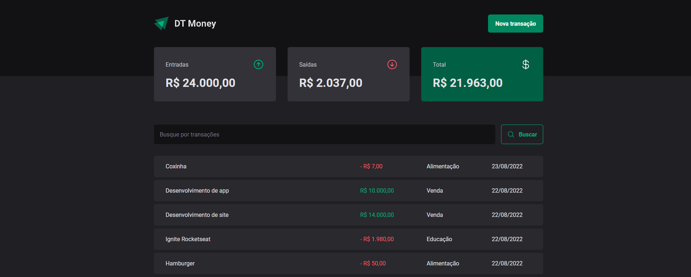
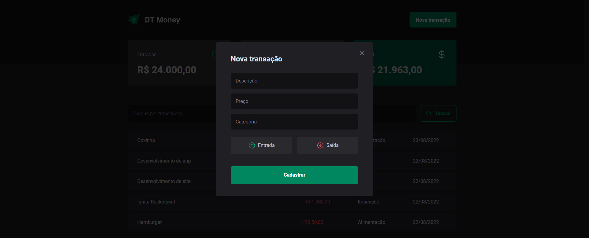

<h1 align="center">
    
</h1>

<span align="center">
    
</span>

Esse projeto é uma aplicação para gestão de finanças onde são inseridos entradas e saídas para o balanço final dos gastos de uma pessoa. Os dados são inseridos em uma Fake API utilizando JSON Server.

## 🛠️ Construído com

Esse projeto foi desenvolvido com as seguintes tecnologias:

- [Vite](https://vitejs.dev)
- [ReactJS](https://reactjs.org)
- [TypeScript](https://www.typescriptlang.org/)
- [Styled Components](https://styled-components.com)
- [JSON Server](https://github.com/typicode/json-server)

### 📋 Pré-requisitos

Para clonar e rodar essa aplicação, será necessário o [Git](https://git-scm.com) e o [Node.js](https://nodejs.org/en/) além do [JSON Server](https://github.com/typicode/json-server) instalados no seu computador.

### 🔧 Como usar

```bash
# Clone este repositório
$ git clone https://github.com/guispati/DT-Money.git

# Abra a pasta criada
$ cd DT-Money

# Instale as dependências
$ npm install

# Inicie o projeto
$ npm run dev

# Inicie o servidor
$ npm run dev:server
```

## 💻 Demonstração

Na tela inicial você pode visualizar as entradas e saídas já cadastradas na API além de poder realizar uma busca para filtrar os seus resultados e ter um resultado das suas entradas, saídas e total realizados de acordo com o resultado da busca:


Ao clicar no botão Nova Transação, é possível cadastrar uma nova transação em um modal pensado na acessibilidade informando uma descrição, valor, categoria e selecionando se é entrada ou saída:


## 📄 Licença

Este projeto está sob a licença MIT - veja o arquivo [LICENSE.md](LICENSE.md) para mais detalhes.

---
⌨️ com ❤️ por [Guilherme Spati](https://github.com/guispati) 😊